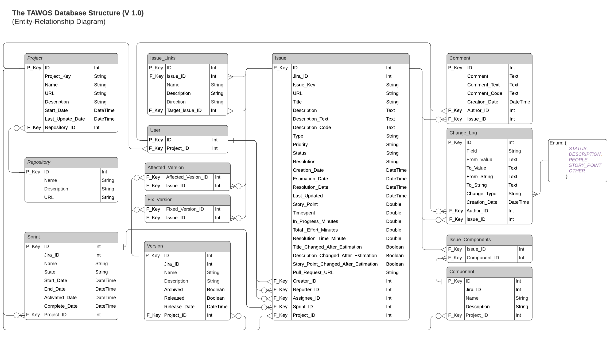

# The TAWOS Dataset (V. 1.1)

:peacock: TAWOS (Peacock in _Farsi_ and _Arabic_) is a dataset of agile open-source software project issues mined from Jira repositories including many descriptive features (raw and derived). The dataset aims to be all-inclusive, making it well-suited to several research avenues, and cross-analyses therein. 

The TAWOS dataset is available to download from [10.5522/04/21308124](http://doi.org/10.5522/04/21308124). Please read the [terms of use](#terms-of-use) before downloading and using the dataset.


## Further Details and Citation Information

This dataset is described and presented in the paper "**A Versatile Dataset of Agile Open Source Software Projects**" authored by [Vali Tawosi](https://vtawosi.github.io/), [Afnan Al-Subaihin](https://afnan.ws/), [Rebecca Moussa](https://scholar.google.com/citations?user=fdm9f9gAAAAJ&hl=en) and [Federica Sarro](http://www0.cs.ucl.ac.uk/staff/F.Sarro/) published in the Proceedings of the [19th International Conference on Mining Software Repositories (MSR 2022)](https://ieeexplore.ieee.org/document/9796320).

Bibtext:
```
@INPROCEEDINGS{9796320,
  author={Tawosi, Vali and Al-Subaihin, Afnan and Moussa, Rebecca and Sarro, Federica},
  booktitle={2022 IEEE/ACM 19th International Conference on Mining Software Repositories (MSR)}, 
  title={A Versatile Dataset of Agile Open Source Software Projects}, 
  year={2022},
  pages={707-711},
  doi={10.1145/3524842.3528029}}

```


## Terms of Use

By downloading and using the TAWOS dataset, you agree to the following terms and conditions:

1. This dataset is published to be used by researchers for research purposes only. Thus, any usage of this dataset for purposes that may cause harm to the contributing users or project owners should be prohibited. The potential user of the dataset shall consider all potential ethical issues arising from the use of this data and refrain from performing analysis or processing that may result in any harm.

2. The data is cleared out of any personally identifiable information. Although there might still exist possible ways to identify the individual contributors by tracing the information back to its source, this is strongly discouraged. 

3. All the projects included in the TAWOS dataset are publicly available online under different open-source licences. Hence, the TAWOS dataset itself is also shared here under an open-source initiative-approved license, specifically Apache License, Version 2.0. 

## Licence

Apache License, Version 2.0.
```
Copyright (c) 2022 The TAWOS Dataset.

Licensed under the Apache License, Version 2.0 (the "License");
you may not use this file except in compliance with the License.
You may obtain a copy of the License at

 http://www.apache.org/licenses/LICENSE-2.0

Unless required by applicable law or agreed to in writing, software
distributed under the License is distributed on an "AS IS" BASIS,
WITHOUT WARRANTIES OR CONDITIONS OF ANY KIND, either express or implied.
See the License for the specific language governing permissions and
limitations under the License.
```


## Installation Instructions

The dataset is stored as a relational database, dumped from MySQL v. 8.0.22.

To start using the dataset, follow these instructions:

**Step 1:** [Install MySQL](https://dev.mysql.com/doc/refman/8.0/en/installing.html) database management system.

**Step 2:** Download and unzip the dataset (.sql file) from [10.5522/04/21308124](http://doi.org/10.5522/04/21308124).

**Step 3:** Setup the database using the downloaded file:

`> mysql -u [user] -p [database_name] < [filename].sql` 

If you are interested in a graphical user interface, you can also install [MySQL Workbench](https://www.mysql.com/products/workbench/).


## Dataset Description

### Contents

The dataset currently contains 458,232 issues from 39 open-source projects selected from 12 public Jira repositories.\* 


|	Repository		|	Project Name					|	Project Key	|
|-------------------|-----------------------------------|---------------|
|	Apache			|	Mesos							|	MESOS		|
|	Apache			|	MXNet							|	MXNET		|
|	Apache			|	Usergrid						|	USERGRID	|
|	Appcelerator	|	Alloy Framework					|	ALOY		|
|	Appcelerator	|	Appcelerator Daemon				|	DAEMON		|
|	Appcelerator	|	Appcelerator Studio				|	TISTUD		|
|	Appcelerator	|	Command-Line Interface			|	CLI			|
|	Appcelerator	|	The Titanium SDK				|	TIMOB		|
|	Appcelerator	|	Titanium Mobile Platform		|	TIDOC		|
|	Appcelerator	|	C++ driver						|	APSTUD		|
|	Atlassian		|	Atlassian Software Server		|	JSWSERVER	|
|	Atlassian		|	Bamboo							|	BAM			|
|	Atlassian		|	Clover							|	CLOV		|
|	Atlassian		|	Confluence Cloud				|	CONFCLOUD	|
|	Atlassian		|	Confluence Server				|	CONFSERVER	|
|	Atlassian		|	Crowd							|	CWD			|
|	Atlassian		|	FishEye							|	FE			|
|	Atlassian		|	Jira Cloud						|	JRACLOUD	|
|	Atlassian		|	Jira Server						|	JRASERVER	|
|	Atlassian		|	Software Cloud					|	JSWCLOUD	|
|	DNN Tracker		|	DotNetNuke Platform				|	DNN			|
|	Hyperledger		|	Blockchain Explorer				|	BE			|
|	Hyperledger		|	Fabric							|	FAB			|
|	Hyperledger		|	Indy Node						|	INDY		|
|	Hyperledger		|	Indy SDK						|	IS			|
|	Hyperledger		|	Sawtooth						|	STL			|
|	Lsstcorp		|	Lsstcorp Data management		|	DM			|
|	Lyrasis			|	Lyrasis Dura Cloud				|	DURACLOUD	|
|	MongoDB			|	Compass							|	COMPASS		|
|	MongoDB			|	MongoDB Core Server				|	SERVER		|
|	MongoDB			|	C++ driver						|	CXX			|
|	MongoDB			|	Evergreen						|	EVG			|
|	MongoDB			|	Java driver						|	JAVA		|
|	Moodle			|	Moodle							|	MDL			|
|	Mulesoft		|	Mule							|	MULE		|
|	Mulesoft		|	Mule APIkit						|	APIKIT		|
|	Sonatype		|	Nexus							|	NEXUS		|
|	Spring			|	DataCass						|	DATACASS	|
|	Spring			|	XD								|	XD			|
<!-- |	Talendforge		|	Talend Big Data					|	TBD			|
|	Talendforge		|	Talend Data Management			|	TMDM		|
|	Talendforge		|	Talend Data Preparation			|	TDP			|
|	Talendforge		|	Talend Data Quality				|	TDQ			|
|	Talendforge		|	Talend Enterprise Service Bus	|	TESB		|
 -->

 \* Version 1.0 of the dataset included an additional repository with 5 projects. Since that repository was removed from the public domain, it has also been removed from the TAWOS dataset version 1.1.

### Database Structure

The database is structured to facilitate custom sampling and future extensions:

<sub><sub>The dataset structure has not changed since version 1.0</sub></sub>


The central entity is `Issue`, which stores several extracted, derived, and computed features for each issue.
Following is a brief summary of each of the included properties which can be either raw or derived.

#### Raw Attributes

##### Issue Links
Every issue may have connections to other issues which indicate relatedness (for example, if two issues are duplicates, or were reflections of the same bug); these connections are stored as links in the `Issue_Link` table. This entity may store the name and description for the link and connect the parent issue to a target issue using foreign keys. Examples for issue links are:

- name = 'Duplicate', Description = 'is duplicated by', Direction = 'INBOUND'
- name = 'Duplicate', Description = 'duplicates', Direction = 'OUTBOUND'
- name = 'Depend', Description = 'is depended on by', Direction = 'INBOUND'
- name = 'Supersede', Description = 'supersedes', Direction = 'OUTBOUND'

##### Comment
This includes every comment posted on the issue, including discussions, with the creation time and author id. All personally identifiable information about the contributors have been replaced by \<USER\> or \<EMAIL\> tags inside the comments.

##### Change_Log
Itemised and chronologically ordered changes made on an issue's attributes are stored in this table.
Every change on an attribute by a user is stored as a record, including the previous and new value for the attribute. 
All personally identifiable information about the contributors (author of the change or subject of the change if it was a user and all references inside changed text fields like description and comment) have been replaced by \<USER\> or \<EMAIL\> tags inside the comments.

##### Component
Each software product is composed of one or more components. This table stores the information about the components for each project. It has a many to many relationship with `Issue` (via the `Issue_Components` table), which means one issue may be related to more than one component and one component may have multiple issues.

##### Version
The `Version` table stores information about the versioning of the software under development. 
This information include the name, description, and release date of the version, and whether it is archived or released. Versions connect to issues via two interim tables (a) Affected versions, and (b) Fix versions.
Affected version is the version where a bug or problem was found and Fix version is the one where the feature is released or a bug is fixed.

##### Sprint
The Sprint table stores the information about the iterations that occurred during the development of the software so far.
Connection with the Issue table records the issues delivered in an specific Sprint. This table includes `State`, `Start_Date`, `End_Date`, `Activated_Date`, and `Completion_Date` of each Sprint.

##### User
This table stores the unique users who interacted within projects included in the dataset. The users, depending on their form of contribution, can take different roles in the form of foreign key names in other tables: The creator of the issue (`Creator_ID` in the `Issue` table), the author of a comment (`Author_ID` in the `Comment` table) or change (`Author_ID` in `the Change_Log` table), or the development team members (`Assignee_ID` and `Reporter_ID` in the `Issue` table).
The User ID provided in the database is a database generated key and has no relation with the User's ID on the original repository.

##### Project and Repository
These two tables store information of the repositories and projects included in the Database.

#### Derived/Computed Attributes

##### Issue/Comment Description Text and Code
The `Description` field holds the long description of the user story or bug report which can contain natural text interleaved with code snippets or stack-traces. To facilitate processing, we separate the code snippets/stack traces and the natural text describing the issue into the `Description_Code` and `Description_Text` fields respectively. We maintain the original description in the `Description` field. Same is done for the `Comment` field from the `Comment` table.
All personally identifiable information about the contributors have been replaced by \<USER\> or \<EMAIL\> tags inside the `Description` and `Description_Text` fields.

##### Resolution Time
The field `Resolution_Time_Minutes` stores the time span (in minutes) between when an issue is marked for the first time as `In Progress` and when it is marked as `Resolved`. This period can be considered as an approximation of the time taken by the development team to resolve the issue. 
Other proxies for time are provided, such as `In_Progress_Time` and `Total_Effort_Time`, indicating, respectively, the implementation time and the development (including code review and testing) time.

##### SP Estimation Date
This field records the time when the Story Point field of the Jira issue report was populated by the developer. This information might be useful, for example, in studies on software effort estimation, in order to properly take into account the chronological order of the estimates.

##### Date and Time
Since the development teams can be geographically distributed, Jira stores events and date-times with timezone offset. We converted and stored all dates and times to a unified timezone, namely the Coordinated Universal Time (UTC). 

##### Field Change Flag
The title and description of the issue are two important pieces of information used by recent automated approaches to produce effort estimates, therefore it is important to know whether these fields have been edited after the initial estimate was done.
The `Title_Changed_After_Estimation` and `Description_Changed_After_Estimation` fields store this flag.
The dataset also include a flag that shows whether the Story Point has been changed/updated after the initial estimate.
Note that these flags are based on the change-logs of the issue.

##### ChangeType in Change_Log Table
We derive `ChangeType` from the name of the field in which the change occured.

This field is calculated to categorise change log updates into one of five categories: 
 - `STATUS`: changes in status of an issue, indicating a transition in the Jira workflow. 
 - `DESCRIPTION`: changes in the issue title or description.
 - `PEOPLE` changes in the assignee or reporter of the issue.
 - `STORY_POINT`: change in the Story Point field of the issue.
 - `OTHER`: Any other change apart from the ones mentioned above.


## Usage Examples

You can use SQL to sample the data both horizontally and vertically. The results can be exported into a csv file.

For example, the following command will select all information in the Project table and store it in a csv file named `TAWOS_DB_Projects.CSV`:

	`SELECT * FROM TAWOS_DB.Project
		INTO OUTFILE '[path]/TAWOS_DB_Projects.CSV'
		FIELDS ENCLOSED BY '"'
		TERMINATED BY ';'
		ESCAPED BY '"'
		LINES TERMINATED BY '\r\n';`

You may need to change your [`--secure-file-priv`](https://dev.mysql.com/doc/refman/5.7/en/security-options.html) option on your mySql server to be able to export the query results to a local file.

Some sample queries:
	
	`SELECT * FROM Issue issue
		WHERE issue.Resolution IS NOT NULL AND
		issue.Type = 'Bug' AND
		issue.Story_Point BETWEEN 1 AND 100 AND
		issue.Story_Point_Changed_After_Estimation is FALSE`

selects all resolved 'Bugs' with a story point value between 1 and 100 which was never updated beyond the original estimate.

	`SELECT * FROM Issue issue 
		WHERE issue.ID in 
		(SELECT link_count.id FROM
		(SELECT COUNT(issue.ID) as links_count, issue.ID as id, issue.Project_ID 
			FROM Issue_Link link JOIN Issue issue on link.Issue_ID = issue.ID 
			GROUP BY issue.ID 
			HAVING links_count > 2 AND issue.Project_ID = 3) as link_count)`

selects all the issues that a) belong to project # 3 and b) link to more than 2 other issues.


## Current Limitations
While the data stored in the database holds a snapshot of the respective repositories at the time of collection, we have found that some of the issues that were created with older versions of some plug-ins in Jira do not follow the new JSON structure. Therefore, the Jira REST Java Client fails to parse them.
As such issues constitute a tiny fraction of the oldest issues in a couple of projects, we disregarded them in the current version. 
	
Furthermore, to extract code snippets and stack traces from the description and comment text we rely on the code tags inserted by Jira plug-ins to format code for the browser. In other words, if Jira did not mark a code snippet or stack trace as a code segment in the description or comment, our tool will not be able to distinguish it from the natural text. In such cases, the code snippet will be treated as text. As a future enhancement of the dataset, we intend to use code detection methods to separate code from natural text more reliably.

## Studies Using TAWOS Data

- Vali Tawosi, Rebecca Moussa, and Federica Sarro, "[On the Relationship Between Story Point and Development Effort in Agile Open-Source Software](https://solar.cs.ucl.ac.uk/pdf/tawosi2022esem.pdf)", 16th ACM/IEEE International Symposium on Empirical Software Engineering and Measurement (ESEM, 2022). See [Scripts and Data](https://github.com/SOLAR-group/SPvsDevelopmentEffort)


- Vali Tawosi, Afnan Al-Subaihin, and Federica Sarro, "[Investigating the Effectiveness of Clustering for Story Point Estimation](https://solar.cs.ucl.ac.uk/pdf/tawosi2022saner.pdf)", 29th IEEE International Conference on Software Analysis, Evolution and Reengineering (SANER, 2022). See [Scripts and Data](https://github.com/SOLAR-group/LHC-SE)


- Vali Tawosi, Rebecca Moussa, and Federica Sarro, "[Deep Learning for Agile Effort Estimation Have We Solved the Problem Yet?](https://arxiv.org/abs/2201.05401)" arXiv preprint arXiv:2201.05401 (2022).

If you use the dataset in your research, please help us keep this list updated by creating a pull request, or letting us know via other means.

## Expansion

We will continue growing the dataset by adding new projects, and new features, as our research demand or produce them.

We also intend to provide a graphical user interface based on Java to allow user make queries on the database and store the results in a file.

### How to contribute

We invite potential users of the dataset to join our effort in growing and enriching this dataset, in order to open door for novel research avenues.

You can contribute by extending the dataset both in depth and breadth, by adding new projects, as well as new features. The database schema creation script is available [here](TAWOS_Database_Schema_Creation_Script.sql).

Please create an Issue here on GitHub and inform us of any problem with the data, or create pull requests to add your contribution to the dataset.

Thank You!

## Last update
7 October 2022

## Contacts
Vali Tawosi vali.tawosi@ucl.ac.uk


